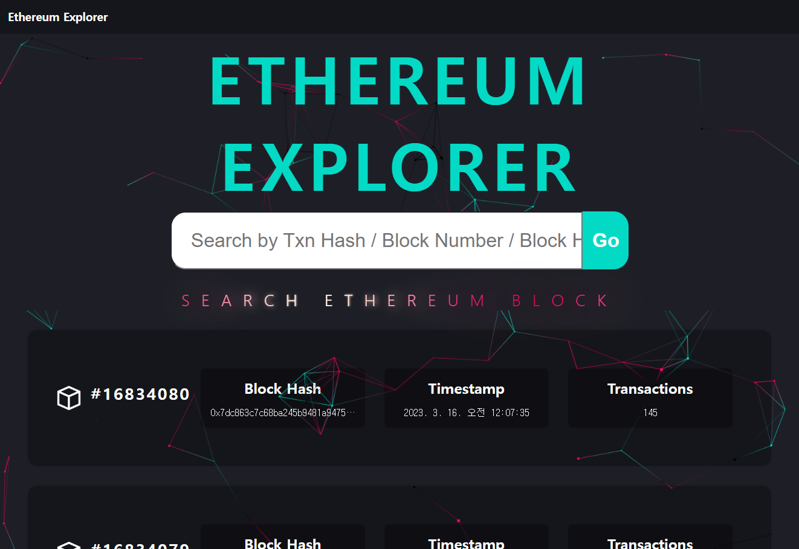

# Ethereum Explorer
백엔드 없이 REACT, Web3.js 만으로 구현한 이더리움 블록체인 탐색기 웹 어플리케이션입니다.
## 주요 기능
* 최신 블록 정보 확인
* 특정 블록 정보 검색 (블록 해시, 블록 넘버)
* 특정 트랜잭션 정보 검색(트랜잭션 해시)

## 설치 및 사용법
1. 해당 레포지토리를 클론 합니다.
```bash
git clone https://github.com/choisangh/ethereum-explorer.git
```
2. 클론한 레포지토리 폴더로 이동합니다.
```bash
cd etereum-explorer
```
3. npm 패키지를 설치합니다.
```bash
npm install
```
4. .env 파일을 통해 환경 변수를 설정합니다.
```makefile

```
5. 앱을 실행합니다.
```bash
npm start
```
6. 브라우저에서 http://localhost:3000/으로 접속합니다.

## 기술 스택
* React
* Web3.js

## 웹 예시
